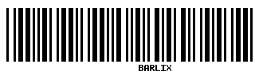

# Barlix



[](https://github.com/ananthakumaran/barlix/actions/workflows/ci.yml)
[](https://hex.pm/packages/barlix)
[](https://hexdocs.pm/barlix/)
[](https://hex.pm/packages/barlix)
[](https://github.com/ananthakumaran/barlix/blob/master/LICENSE.md)
[](https://github.com/ananthakumaran/barlix/commits/master)


Barcode generator for Elixir.

## Installation

The package can be installed by adding `:barlix` to your list of dependencies in
`deps/0` function of `mix.exs` file:

```elixir
{:barlix, "~> 0.6"}
```

## Example

```elixir
Barlix.Code39.encode!("BARLIX") |> Barlix.PNG.print(file: "/tmp/barcode.png")
```

## Copyright and License

Copyright (c) 2016 Anantha Kumaran

This work is free. You can redistribute it and/or modify it under the
terms of the MIT License. See the [LICENSE.md](./LICENSE.md) file for more details.
